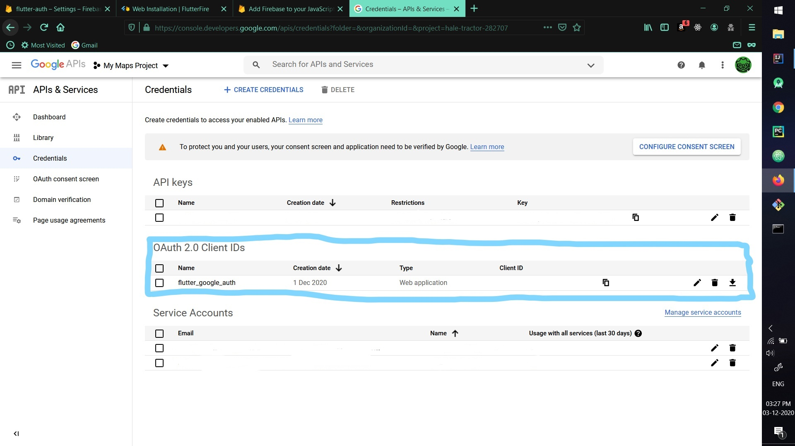
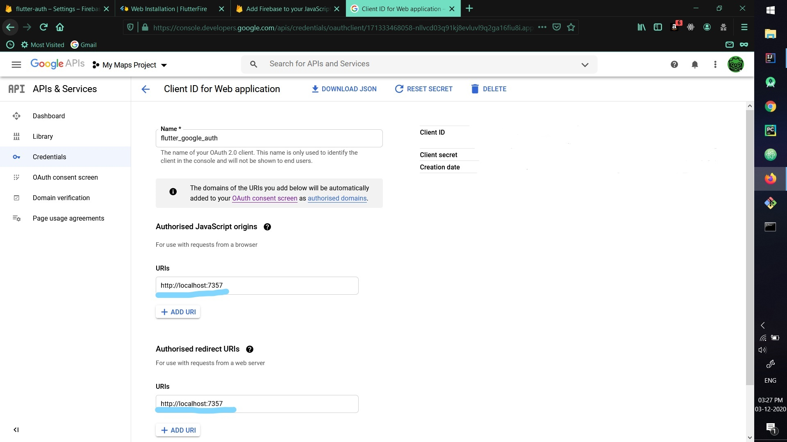
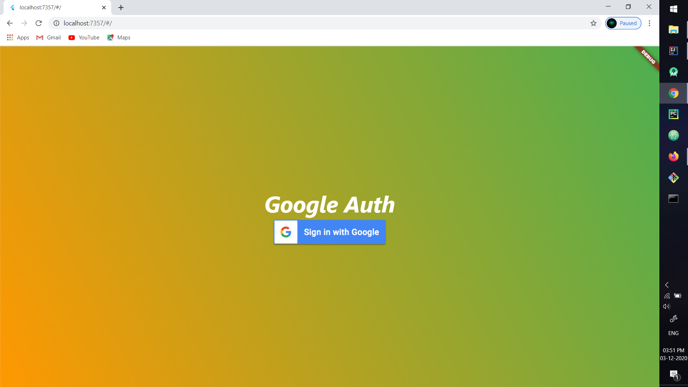
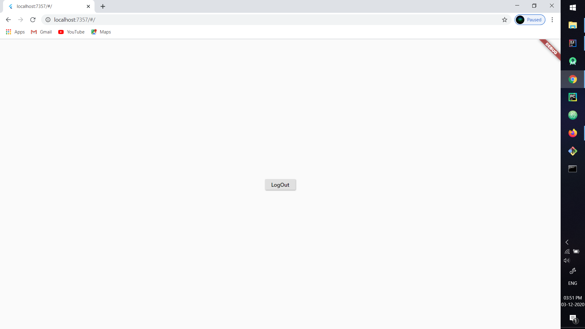

# 🎯 Flutter & Firebase: Google Authentication 🎯

This Project shows how to implement Google Authentication process in Flutter, using Firebase.
 
## Project Features
- Improved widget tree.
- SignIn Silently

## Preview


## Flutter-Firebase Setup For Web
- Update **web/index.html**
```html
<html>
  ...
  <body>
    <!-- Add this line -->
    <script src="https://www.gstatic.com/firebasejs/7.20.0/firebase-app.js"></script>

    <script src="main.dart.js" type="application/javascript"></script>
  </body>
</html>
```
- Setup Firebase for Web from your firebase console.

- Use firebaseConfig to initialize Firebase.
```html

<!-- web/index.html -->

<html>
  ...
  <body>
    <script src="https://www.gstatic.com/firebasejs/7.20.0/firebase-app.js"></script>

    <!-- Firebase Configuration -->
    <script>
      var firebaseConfig = {
        apiKey: "...",
        authDomain: "[YOUR_PROJECT].firebaseapp.com",
        databaseURL: "https://[YOUR_PROJECT].firebaseio.com",
        projectId: "[YOUR_PROJECT]",
        storageBucket: "[YOUR_PROJECT].appspot.com",
        messagingSenderId: "...",
        appId: "1:...:web:...",
        measurementId: "G-...",
      };

      // Initialize Firebase
      firebase.initializeApp(firebaseConfig);
    </script>

    <script src="main.dart.js" type="application/javascript"></script>
  </body>
</html>
```
- Also, To Successfully use the Google Authentication API, We need to whitelist the domain name in [**Google APIs and Services**]("https://console.developers.google.com/apis/dashboard?").

Google APIs & Service Dashboard
 

 

Take a look at the second screenshot as, I'm applying my localhost:7357 port to whitelist it.
If you somehow forgot to whitelist your domain name the google-auth process will not work.

- After whitelisting your domain name, add one meta tag to **web/index.html** as :-
```html
  <meta name="google-signin-client_id" content="Paste Your Client-Id here From Google APIs and Services">
```
- To run it on web
```
flutter run -d web-server --web-port 7357
```


